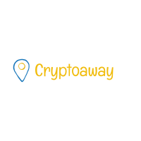
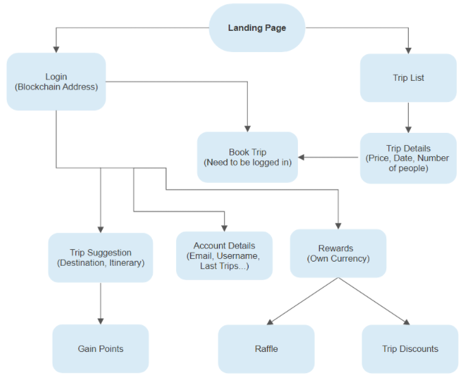
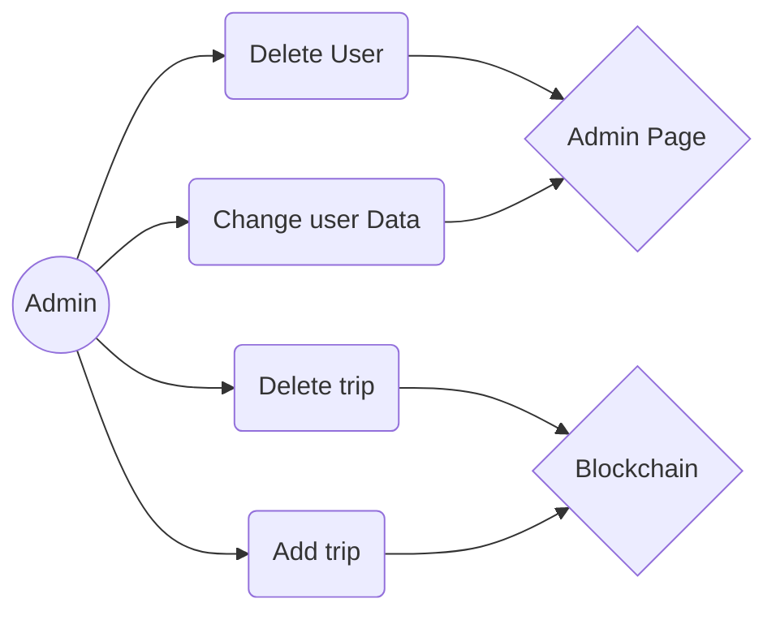
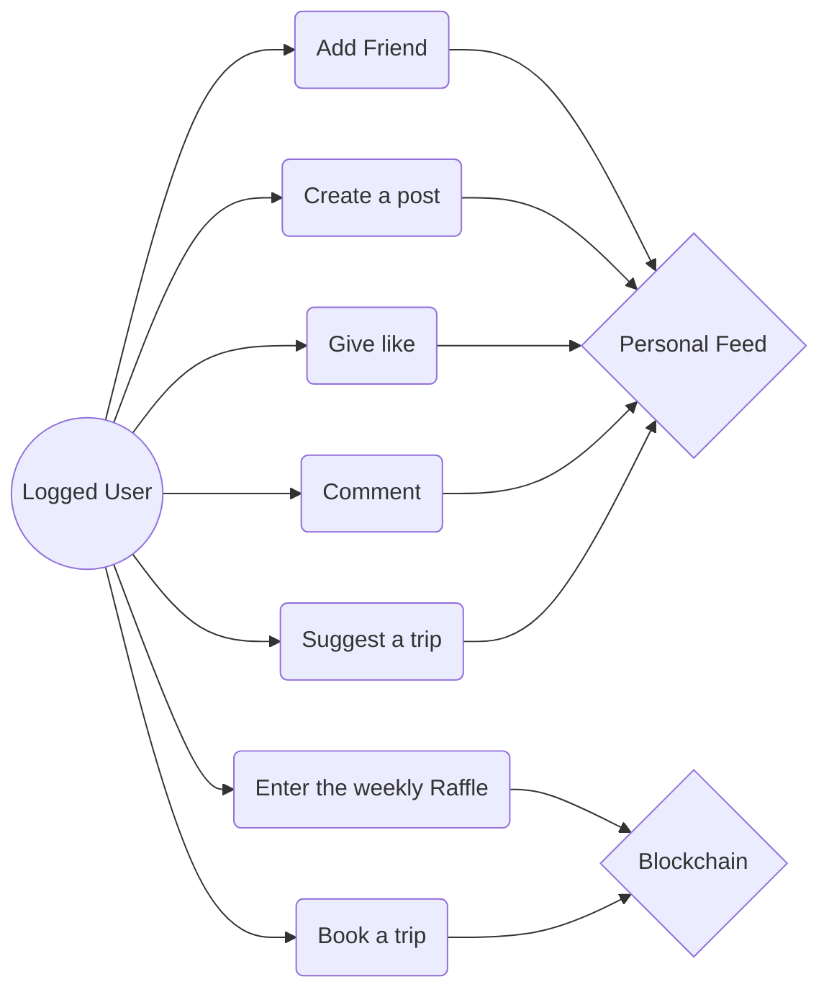
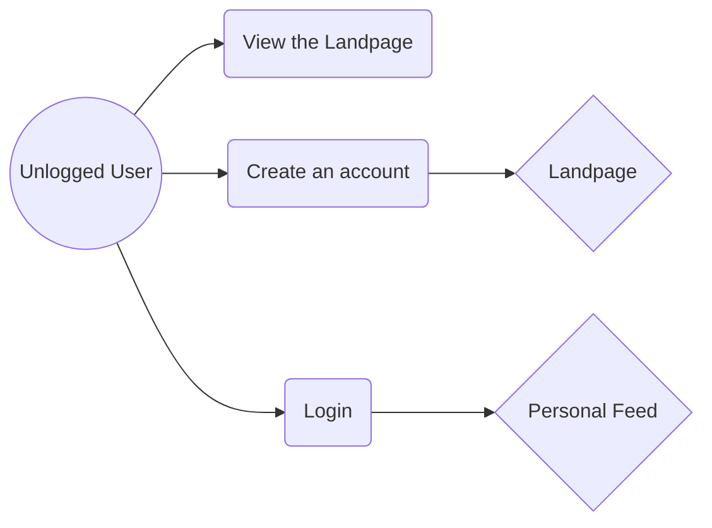
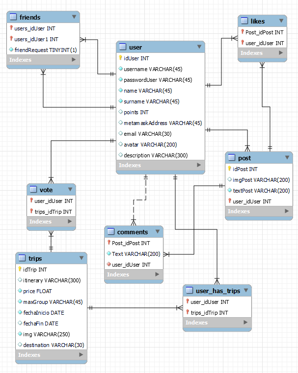

#

  

#

  A social network Web App where you can add friends, give likes to their posts, comment, earn `$Away` the cryptocurrency of the app and the most important feature. Travel with your friends or even strangers, paying with cryptocurrencies!
  

#
   
  &nbsp;
  
  <!-- TABLE OF CONTENTS -->

  
:scroll:Table of Contents

  <ol>
    <li>
      <a href="#stack">Stack</a>
    </li>
    <li>
      <a href="#roadmap">Roadmap</a>
    </li>
    <li><a href="#details">Details</a></li>
    <li><a href="#rewards">Token $away and rewards</a></li>
    <li>
      <a href="#flowChart">Flow Charts</a>
      <li><a href="#flowChart">Admin</a></li>
      <li><a href="#flowChart">Logged User</a></li>
      <li><a href="#flowChart">Unlogged User</a></li>
    </li>
    <li><a href="#EER">Database EER</a></li>
    <li><a href="#navigation">Navigation</a></li>
    <li><a href="#userInteractions">User Interactions</a></li>
    <li><a href="#contact">Contact</a></li>
  </ol>

 &nbsp;
  #
   

  <h2>:books:Stack</h2>

Techonologies used in this project

  
  
  | Frontend | Backend | Others |
  |--|--|--|
  |      |     |      |
  
  &nbsp;
  
   #
  

  
  
  

    <h2 align="center">:calendar:Roadmap</h2>
  
  - [ ] **Pages**
    - [x] ~~**Registered User**~~
    - [x] ~~**Profile**~~
    - [x] ~~**Trip section**~~
    - [x] ~~**Register**~~
    - [ ] **Landing**
    - [ ] **Admin**
    - [ ] **Unregistered user**
    - [ ] **Specific for each trip**
   
  - [ ] **User actions**
    - [x] ~~**Give like to a post**~~
    - [x] ~~**Create a post**~~
    - [x] ~~**Modify user profile**~~
    - [ ] **Create a comment**
    - [ ] **Create a trip suggestion**
    
  - [ ] **Blockchain**
    - [ ] **Smart Contracts**
    - [ ] **$Away token**
    - [ ] **Give rewards**
    - [ ] **Pay the trip with cryptocurrencies**
    - [ ] **Weekly raffle**
    - [ ] **Implement the discount on any trip**
  
  - [ ] **App translation**
    - [x] ~~**English**~~
    - [ ] **Spanish**
    - [ ] **German**

  - [ ] **Others**
    - [x] ~~**Hosting**~~
    - [x] ~~**Separate server for DB and Web**~~
    - [x] ~~**Responsive**~~
    - [ ] **Protect endpoints**
    - [ ] **Async calls**
    - [ ] **MVC**
    - [ ] **Domain name**
    - [ ] **Drag and drop**
    
  

  &nbsp;
  
#

<h2 align="center">:page_with_curl:Details</h2>
  
My idea is to make a hybrid application (there are many applications that implement this feature, since the storage in the blockchain is quite expensive, so the information with more volume and less sensitive is stored in conventional BDD while the sensitive data is stored in the Blockchain), mixing in the backend PHP along with Solidity (the coding language of the Ethereum Blockchain). 
The blockchain itself is a decentralized database, so I plan to host the currency I will create `$away` there, along with the `raffle` and reward logic, plus the payment for the trips.

&nbsp;

#

<h3 id="rewards" align="center">:moneybag:$away and rewards</h3>
  
  #
  
To attract users, a specific cryptocurrency will be created for the ecosystem of our web app called `$away`, the interaction is simple, every time we perform each of the following actions we will be rewarded with "X" amount of `$away`.
The token $away will be sent to the digital `wallet` of the user (Metamask).

| Task | Reward |
|--|--|
| Book a trip | `+40 $away`|
| Suggest a trip with itinerary (Need to be approved by the team) | `+20 $away`|
| Rate a trip and leave a comment | `+5 $away`|

:money_with_wings:What is the utility of $away for the users?

| Amount of $away | Reward |
|--|--|
| `$50` | Discount of 15$ on any trip |
| `$20` | Enter the weekly raffle to have a chance to win a free trip!|

  &nbsp;
  
  #

  <h2 align="center">:chart_with_upwards_trend:Flow Charts</h2>
   
  
  
  &nbsp;
  <h2 align="center">Admin</h2>
  

  &nbsp;

  
  <h2 align="center">Logged User</h2>
  

  &nbsp;
  
  <h2 align="center">Unlogged User</h2>
  

  

&nbsp;
  
#

  <h2>:open_file_folder:Database EER</h2>
   
  

 &nbsp;
 
#

  
 <h2 align="center">:walking:Navigation</h2>
  

We can move around the App through this browser located on the upper area.

  

### Feed

  
&nbsp;
  
#
  
 <h2 align="center" id="userInteractions">:eyes:User interactions</h2>
  
### Give likes to your friend's posts

### Friend suggestions

### Book a trip

### User trips

### Add a friend

### Accept or reject a friend request

### See and delete friends

### Create own posts

### View own posts

### Modify user profile
To modify your profile, you must go to the left panel and click on the icon shown below.

A form is presented to modify the profile.

&nbsp;

#

<h3 align="left" id="contact">:computer:Connect with me </h3>

 

